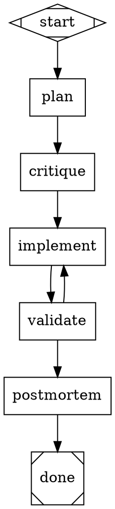

# SPRINT-009: KitchenSink Attractor Run — Making OmniUI TUI Features Real

## Overview

Sprint 009 is a focused rendering and interaction sprint that turns OmniUI from a 99.3% compile-surface SwiftUI clone into a functional TUI framework. Previous sprints built the agent runtime, mission orchestration, and OmniSkills infrastructure. This sprint turns inward to the UI layer: OmniUICore primitives, modifiers, and the NotcursesRenderer must produce visually meaningful, interactive terminal output for every feature exercised by KitchenSink.

The sprint is structured as an **attractor run** — a series of per-wave DOT-graph-driven `plan → critique → implement → validate → postmortem → done` pipelines executed through `AttractorTaskExecutor`. Each wave targets a cohesive feature group, produces updated pixel baselines, and passes validation gates before the next wave begins.

### Positions Taken

1. **Animation model**: Tick-driven re-render, not frame interpolation. `withAnimation` schedules a state change that applies over multiple ticks at the existing ~120ms tick rate. No 60fps ambitions — terminal animation means spinner cycling, progress bar advancing, and highlight pulsing.

2. **Shape rendering**: Dual-path. Terminals with Kitty graphics protocol get pixel-perfect shapes via the existing sprixel pipeline. Terminals without pixel support get Unicode block/braille character fills. Both must produce recognizable shapes — no blank sections.

3. **@Observable/@Bindable**: Real observation tracking. The `@Observable` macro (in `SwiftUIMacros/ObservableMacro.swift`) currently only adds `ObservableObject` conformance. This sprint bridges `ObservationRegistrar.withMutation` to `_UIRuntime.setNeedsRender()` so mutations propagate to the render loop.

4. **SwiftData/@Query**: Real in-memory query support extending the existing `SwiftDataCompat.swift`. `modelContainer` wires a `ModelContext` that supports `insert`, `delete`, and `@Query` with `FetchDescriptor` sorting and basic predicate filtering. No persistence, no migration.

5. **Gesture system**: Full mouse-event mapping for terminal-feasible gestures. `onTapGesture` already works; this sprint adds `DragGesture` (mouse drag), `LongPressGesture` (hold detection), and multi-tap. `MagnificationGesture` and `RotationGesture` remain compile-only stubs.

6. **Table rendering**: Real multi-column layout with header row, column alignment, and row selection — not a list fallback.

7. **Grid/GridRow and LazyHGrid**: Cell-based grid layout using `GridItem` specifications. Lazy evaluation is API-compatible but eagerly rendered (lazy is not meaningful for terminal text cells).

8. **AsyncImage**: Fetch URL, render via Kitty graphics protocol if available, otherwise show `[img: filename]` placeholder. Only `http://` and `https://` schemes. 10s timeout, 10MB cap.

9. **Preference propagation**: Deferred to post-sprint. Requires bottom-up data flow that conflicts with current single-pass top-down render. Documented as known limitation.

10. **clipShape**: Border-style change at clip boundary. Terminal cannot clip arbitrary regions, but a visible border using the shape's outline characters provides meaningful visual feedback.

11. **KitchenSink main.swift**: Unchanged. All testing driven by agents/LLMs taking screenshots. No scenario seeding env vars in the demo code itself.

12. **DOT structure**: One linear attractor graph per wave: `plan → critique → implement → validate → postmortem → done`. A shell wrapper sequences waves.

## Use Cases

1. **Shape showcase renders visibly**: Filled rectangles, circles, ellipses, and capsules using Unicode block characters on non-pixel terminals and Kitty sprixels on pixel-capable terminals.

2. **Animation tick loop drives visual changes**: Spinner cycles characters, progress bar advances, pulse label changes color. `withAnimation` wraps state changes to apply over multiple ticks.

3. **TabView shows clear panel separation**: Tab buttons with visual selection indicator (inverse/underline), box-drawing border between tab bar and content panel.

4. **Form(.grouped) renders with inset group styling**: Section headers offset with horizontal rules, fields indented, group boundaries visible.

5. **Table renders multi-column**: Aligned columns with headers, `│`-separated columns, row selection highlight.

6. **Grid layouts work**: LazyVGrid, LazyHGrid, and Grid/GridRow produce cell-based layouts with proper spacing from GridItem specifications.

7. **Tree expand/collapse is interactive**: `List(children:)` shows disclosure indicators (`▸`/`▾`) that respond to click/enter, expanding and collapsing subtrees.

8. **SecureField masks input**: Characters replaced with `●` during input; binding receives real text.

9. **ProgressView spinner cycles**: Indeterminate ProgressView cycles through braille spinner characters on each tick.

10. **@Observable triggers re-renders**: Mutating an `@Observable` model property causes dependent views to re-render on next frame.

11. **SwiftData CRUD works**: Insert, delete, and query operations via `ModelContext` produce visible results in the KitchenSink SwiftData section.

12. **Gestures map to mouse events**: DragGesture fires on mouse drag, LongPressGesture fires on sustained press, multi-tap detection works.

## Architecture

### Rendering Pipeline (Unchanged Core)

```text
View tree → _makeNode() → _VNode tree → RenderSnapshot(ops) → NotcursesRenderer paint loop
                                              |
                                         RenderOp[]
                                              |
                              ┌───────────────┼───────────────┐
                              │               │               │
                          .glyph          .fillRect        .shape
                          .textRun        .pushClip        (sprixel)
                                          .popClip
```

### Per-Wave Attractor DOT Template

Each wave uses the same linear graph shape. Only prompts and validation commands vary:



### Wave Sequencing

```text
KitchenSinkWave manifest (per wave)
  → KitchenSinkAttractorWorkflowTemplate (emits DOT)
  → AttractorTaskExecutor (runs pipeline)
  → artifacts: workflow.dot, build log, smoke log, pixel diffs, screenshots
  → next wave
```

## Implementation

### Wave 0: Execution Substrate (~15% of effort)

**Goal**: Land the attractor run infrastructure before changing renderer behavior. Build the wave manifest system, workflow template, runner, and test harness extensions.

**Features**:
- `KitchenSinkWave` manifest type: wave ID, feature list, owned files, targeted test cases, expected artifacts
- `KitchenSinkAttractorWorkflowTemplate`: emits per-wave DOT graphs with the linear plan→critique→implement→validate→postmortem→done shape
- `KitchenSinkAttractorRunner` executable: local CLI entrypoint for `swift run KitchenSinkAttractorRunner wave-01`
- `scripts/tui-test.sh` extension: `TUI_TEST_CASES` env var for targeted case selection
- `scripts/tui-test-wave.sh`: one-command wrapper around wave manifests

**Files**:
| File | Action | Change |
|------|--------|--------|
| `Package.swift` | Modify | Add KitchenSinkAttractorRunner executable target |
| `Sources/TheAgentWorker/Attractor/KitchenSinkWave.swift` | Create | Wave manifest type |
| `Sources/TheAgentWorker/Attractor/KitchenSinkAttractorWorkflowTemplate.swift` | Create | Per-wave DOT generation |
| `Sources/KitchenSinkAttractorRunner/main.swift` | Create | Local runner entrypoint |
| `scripts/tui-test.sh` | Modify | Add TUI_TEST_CASES support |
| `scripts/tui-test-wave.sh` | Create | Wave wrapper script |
| `Tests/TheAgentWorkerTests/KitchenSinkAttractorWorkflowTemplateTests.swift` | Create | Validate generated DOT graphs |

**Validation**:
```bash
swift test --filter KitchenSinkAttractorWorkflowTemplateTests
swift build --product KitchenSink
swift build --product KitchenSinkAttractorRunner
OMNIUI_SMOKE_SECONDS=5 .build/debug/KitchenSink --notcurses
```

---

### Wave 1: Shapes, Visual Modifiers, and ProgressView (~15% of effort)

**Goal**: Every KitchenSink section that draws shapes, progress indicators, or applies visual modifiers produces visible, recognizable output.

**Features**:
- Unicode block fill for shapes: `█` for Rectangle, `╭╮╰╯│─` for RoundedRectangle, braille approximation for Circle/Ellipse/Capsule
- `.clipShape` renders as a border around clipped content using the shape's outline characters
- `.scaleEffect` maps to bold + color intensity shift (>1) or dim (≤1)
- ProgressView indeterminate spinner: cycle through braille characters (`⠋⠙⠹⠸⠼⠴⠦⠧⠇⠏`) per tick
- ProgressView determinate bar: `[████░░░░░░]` proportional fill
- Label systemImage: map common SF Symbol names to Unicode equivalents (`checkmark`→`✓`, `gear`→`⚙`, etc.) with `[name]` fallback

**Files**:
| File | Action | Change |
|------|--------|--------|
| `Sources/OmniUICore/Primitives.swift` | Modify | Shape Unicode fill helper, ProgressView spinner/bar modes |
| `Sources/OmniUICore/Modifiers.swift` | Modify | clipShape border ops, scaleEffect mapping |
| `Sources/OmniUICore/Shapes.swift` | Modify | Unicode shape fallback renderers |
| `Sources/OmniUICore/BrailleRaster.swift` | Modify | Braille fill for circles/ellipses |
| `Sources/OmniUINotcursesRenderer/NotcursesRenderer.swift` | Modify | Unicode shape fallback in .shape handler, spinner tick |
| `Sources/OmniUICore/SFSymbolMap.swift` | Create | systemName → Unicode lookup table |

**Validation**:
```bash
OMNIUI_SMOKE_SECONDS=5 .build/debug/KitchenSink --notcurses
TUI_TEST_MODE=kitty scripts/tui-test.sh
scripts/ghostty-lab.sh record-gif  # capture shapes section
```

**New baselines**: `wave1_shapes_initial.png`, `wave1_shapes_final.png`, `wave1_progress.png`

---

### Wave 2: Layout and Chrome (~20% of effort)

**Goal**: Container views get proper terminal chrome — borders, headers, column alignment, and visual separation.

**Features**:
- **TabView**: Tab bar with `[Tab1]  Tab2  Tab3` selection indicator (inverse), box-drawing border between bar and content
- **Form(.grouped)**: Inset group sections with `─── Header ───` horizontal rules, indented fields, vertical spacing
- **Table**: Multi-column layout with header row, `│`-separated columns, right-aligned numerics, row selection highlight
- **LazyVGrid/LazyHGrid**: Cell-based layout from GridItem specs (`.fixed`, `.flexible`, `.adaptive`), proper spacing
- **Grid/GridRow**: Explicit grid layout with `gridCellColumns` span support
- **NavigationSplitView**: Proportional column width from `navigationSplitViewColumnWidth(min:ideal:)` with `│` separator

**Files**:
| File | Action | Change |
|------|--------|--------|
| `Sources/OmniUICore/Primitives.swift` | Modify | TabView chrome, Table multi-column, Form grouped sections, LazyHGrid |
| `Sources/OmniUICore/Modifiers.swift` | Modify | navigationSplitViewColumnWidth stores min/ideal/max in environment |
| `Sources/OmniUINotcursesRenderer/NotcursesRenderer.swift` | Modify | Tab bar inverse highlight, table column separators, form horizontal rules |
| `Sources/OmniUICore/Grid.swift` | Create | Grid, GridRow, gridCellColumns modifier, layout algorithm |

**Validation**:
```bash
OMNIUI_SMOKE_SECONDS=5 .build/debug/KitchenSink --notcurses
TUI_TEST_MODE=kitty scripts/tui-test.sh
```

**New interaction scripts**: `tabview_switch.sh`, `table_scroll.sh`
**New baselines**: `wave2_tabview.png`, `wave2_form.png`, `wave2_table.png`, `wave2_grid.png`

---

### Wave 3: Interaction and Gestures (~15% of effort)

**Goal**: Stateful interactive features respond correctly to keyboard and mouse input.

**Features**:
- **List(children:) tree**: Disclosure indicators (`▸`/`▾`) toggle on click/enter, child rows indent by 2 columns per depth, collapsed subtrees hidden
- **EditButton/.onDelete**: EditButton toggles edit mode; in edit mode, rows show `[✕]` delete button calling `.onDelete` with IndexSet
- **SecureField masking**: ncreader input intercepted; display shows `●` per character, binding receives real text
- **DragGesture**: Mouse button1 press + motion → `DragGesture.Value` with `startLocation`, `location`, `translation`. Fire `onChanged`/`onEnded`
- **LongPressGesture**: Track button1 press duration; fire after `minimumDuration` (default 0.5s). Cancel if mouse moves beyond `maximumDistance`
- **onTapGesture(count:)**: Multi-tap detection with 300ms window between taps

**Files**:
| File | Action | Change |
|------|--------|--------|
| `Sources/OmniUICore/Primitives.swift` | Modify | Tree toggle logic, EditButton mode, SecureField masking |
| `Sources/OmniUICore/GeneratedSwiftUISignatureSink.swift` | Modify | Gesture value/callback wiring (DragGesture, LongPressGesture) |
| `Sources/OmniUINotcursesRenderer/NotcursesRenderer.swift` | Modify | Mouse drag state machine, long-press timer, SecureField ncreader masking |

**Validation**:
```bash
OMNIUI_SMOKE_SECONDS=5 .build/debug/KitchenSink --notcurses
TUI_TEST_MODE=kitty scripts/tui-test.sh
```

**New interaction scripts**: `tree_expand.sh`, `edit_delete.sh`, `secure_field.sh`
**New baselines**: `wave3_tree_expanded.png`, `wave3_tree_collapsed.png`, `wave3_secure_field.png`

---

### Wave 4: Data and Observation (~15% of effort)

**Goal**: Reactive data flow works end-to-end. Model mutations trigger re-renders. SwiftData operations produce visible results.

**Features**:
- **@Observable runtime wiring**: Bridge `ObservationRegistrar.withMutation` → `_UIRuntime.setNeedsRender()`. The macro in `ObservableMacro.swift` currently emits `ObservableObject` conformance only — extend it to emit `ObservationRegistrar` hooks, or bridge at runtime.
- **@Bindable two-way binding**: `@Bindable` creates `Binding` instances through `@Observable` objects. Mutations trigger observation → re-render path.
- **ModelContext real operations**: Extend existing `SwiftDataCompat.swift` in-memory store. `insert()` adds, `delete()` removes, `.save()` is no-op.
- **@Query runtime**: `@Query` observes `ModelContext` and re-evaluates `FetchDescriptor` on context change. Support `sortBy` (single key path) and basic `#Predicate` filtering.

**Files**:
| File | Action | Change |
|------|--------|--------|
| `Sources/OmniUICore/ObservableObjects.swift` | Modify | Bridge observation change notifications to setNeedsRender |
| `Sources/OmniUICore/State.swift` | Modify | @Bindable observation path |
| `Sources/OmniUICore/SwiftDataCompat.swift` | Modify | ModelContext in-memory store, @Query with FetchDescriptor |
| `Sources/SwiftUIMacros/ObservableMacro.swift` | Modify | Ensure @Observable emits ObservationRegistrar hooks |

**Validation**:
```bash
OMNIUI_SMOKE_SECONDS=5 .build/debug/KitchenSink --notcurses
TUI_TEST_MODE=kitty scripts/tui-test.sh
swift test --filter OmniUICore
```

**New interaction scripts**: `observable_model.sh`, `swiftdata_crud.sh`
**New baselines**: `wave4_observable.png`, `wave4_swiftdata.png`

---

### Wave 5: Animation, Transitions, AsyncImage, and Polish (~20% of effort)

**Goal**: Terminal-appropriate animation, enter/exit transitions, async content loading, and final polish.

**Features**:
- **withAnimation tick scheduler**: `withAnimation(.easeInOut(duration: 0.3))` wraps a state mutation. Runtime interpolates over N ticks (duration / tick_interval). Easing curves: `.linear`, `.easeIn`, `.easeOut`, `.easeInOut`.
- **.transition**: `.opacity` fades in/out over ticks. `.slide` offsets horizontally. `.scale` interpolates scale factor. `.asymmetric` applies different insert/removal transitions.
- **AsyncImage**: URL fetch via `URLSession`. Kitty graphics on capable terminals, `[img: filename]` placeholder otherwise. Security: only http/https, 10s timeout, 10MB cap, no credentials.
- **Polish pass**: Audit every KitchenSink section for visual consistency — uniform section headers, consistent spacing, no blank/garbled sections.

**Files**:
| File | Action | Change |
|------|--------|--------|
| `Sources/SwiftUI/Animation.swift` | Modify | withAnimation tick scheduler, Animation curve definitions |
| `Sources/OmniUICore/Modifiers.swift` | Modify | .transition modifier with enter/exit animation state |
| `Sources/OmniUICore/Primitives.swift` | Modify | AsyncImage fetch + render, conditional view transition tracking |
| `Sources/OmniUICore/View.swift` | Modify | Animation state storage per view identity |
| `Sources/OmniUINotcursesRenderer/NotcursesRenderer.swift` | Modify | Animation tick interpolation, AsyncImage sprixel rendering |

**Validation**:
```bash
OMNIUI_SMOKE_SECONDS=10 .build/debug/KitchenSink --notcurses
TUI_TEST_MODE=kitty scripts/tui-test.sh
scripts/ghostty-lab.sh record-gif  # full demo with animations
```

**New baselines**: `wave5_animation.png`, `wave5_full_demo.png`
**New VHS tape**: `Tests/tui/tapes/full_demo.tape`

## Files Summary

| File | Waves | Nature |
|------|-------|--------|
| `Package.swift` | 0 | Modify — add runner target |
| `Sources/TheAgentWorker/Attractor/KitchenSinkWave.swift` | 0 | Create — wave manifest type |
| `Sources/TheAgentWorker/Attractor/KitchenSinkAttractorWorkflowTemplate.swift` | 0 | Create — per-wave DOT generation |
| `Sources/KitchenSinkAttractorRunner/main.swift` | 0 | Create — local runner |
| `Sources/OmniUICore/Primitives.swift` | 1,2,3,5 | Modify — shapes, Table/Grid/TabView/Form, tree toggle, AsyncImage |
| `Sources/OmniUICore/Modifiers.swift` | 1,2,5 | Modify — clipShape, scaleEffect, transition, column width |
| `Sources/OmniUICore/Shapes.swift` | 1 | Modify — Unicode shape fallback |
| `Sources/OmniUICore/BrailleRaster.swift` | 1 | Modify — braille fills for circles/ellipses |
| `Sources/OmniUICore/SFSymbolMap.swift` | 1 | Create — systemName → Unicode lookup |
| `Sources/OmniUICore/Grid.swift` | 2 | Create — Grid, GridRow, layout algorithm |
| `Sources/OmniUICore/ObservableObjects.swift` | 4 | Modify — observation → render bridge |
| `Sources/OmniUICore/State.swift` | 4 | Modify — @Bindable observation path |
| `Sources/OmniUICore/SwiftDataCompat.swift` | 4 | Modify — ModelContext store, @Query runtime |
| `Sources/OmniUICore/View.swift` | 5 | Modify — animation state storage |
| `Sources/SwiftUI/Animation.swift` | 5 | Modify — withAnimation scheduler, curves |
| `Sources/SwiftUIMacros/ObservableMacro.swift` | 4 | Modify — @Observable hooks |
| `Sources/OmniUINotcursesRenderer/NotcursesRenderer.swift` | 1,2,3,5 | Modify — Unicode shapes, chrome, gestures, animation |
| `Sources/OmniUICore/GeneratedSwiftUISignatureSink.swift` | 3 | Modify — gesture value/callback wiring |
| `scripts/tui-test.sh` | 0 | Modify — TUI_TEST_CASES support |
| `scripts/tui-test-wave.sh` | 0 | Create — wave wrapper |
| `Tests/TheAgentWorkerTests/KitchenSinkAttractorWorkflowTemplateTests.swift` | 0 | Create — DOT validation |
| `Tests/tui/baselines/wave*.png` | 1-5 | Create — pixel baselines per wave |
| `Tests/tui/interactions/*.sh` | 2-4 | Create — interaction scripts per feature |
| `Tests/tui/tapes/full_demo.tape` | 5 | Create — complete demo recording |
| `docs/swiftui-non-renderer-parity.md` | 5 | Modify — document accepted approximations and deferrals |

## Definition of Done

### Per-Wave Gates

- [ ] `swift build --product KitchenSink` compiles cleanly with Swift 6 strict concurrency (zero warnings)
- [ ] `OMNIUI_SMOKE_SECONDS=5 .build/debug/KitchenSink --notcurses` exits cleanly (exit code 0)
- [ ] `TUI_TEST_MODE=kitty scripts/tui-test.sh` passes with updated baselines (odiff < 0.5%)
- [ ] Wave-specific interaction scripts pass
- [ ] `scripts/ghostty-lab.sh record-gif` captures wave features visibly
- [ ] No regressions in existing baselines from prior waves
- [ ] Attractor pipeline completes with artifacts collected

### Sprint-Level Done

- [ ] Every KitchenSink section renders meaningfully — no blank, invisible, or garbled sections
- [ ] All 10 "partially working" items produce visually distinct, recognizable output
- [ ] All 11 "not working" items have real behavior or documented deferral (only preference propagation deferred)
- [ ] `swift test` passes (existing + new unit tests)
- [ ] New pixel baselines committed to `Tests/tui/baselines/`
- [ ] New interaction scripts committed to `Tests/tui/interactions/`
- [ ] Full-demo VHS tape and Ghostty GIF committed
- [ ] `KitchenSink/main.swift` unchanged
- [ ] Parity docs updated with accepted terminal approximations and deferrals
- [ ] KitchenSinkAttractorRunner can execute all 6 waves end-to-end

## Risks

| Risk | Likelihood | Impact | Mitigation |
|------|-----------|--------|------------|
| Unicode shape approximations look poor on some terminal fonts | Medium | Low | Multiple fill strategies (block, braille, half-block); auto-detect via `_TermCaps` |
| @Observable macro doesn't emit ObservationRegistrar hooks correctly | Medium | High | Audit `ObservableMacro.swift` output in Wave 4 plan stage; fix macro before bridge |
| SwiftData @Query with #Predicate needs complex macro support | Medium | Medium | Implement sort-only first; predicate filtering is stretch. Document if deferred |
| Mouse drag state machine conflicts with scroll/click handling | Medium | Medium | Gesture recognition runs after scroll/click; drag only on views with `.gesture(DragGesture())` |
| Animation interpolation causes flicker on slow terminals | Medium | Low | Cap minimum tick interval; skip frames if render exceeds tick period |
| Pixel baselines are flaky without scenario seeding | High | High | Agent-driven testing takes screenshots at known states; validation is screenshot-based not Tab-chain-based |
| `Primitives.swift` grows unmanageably large (2229+ lines) | Medium | Medium | Extract Grid to new file; keep waves focused on owned symbols |
| CI/Docker font rendering differs from local macOS | Low | Medium | Baselines captured in Docker (Kitty mode); Unicode mode is graceful degradation |
| `ForEach` doesn't key runtime state off `id` — tree/edit state bugs | Medium | Medium | Verify identity keying in Wave 3 plan stage; fix if broken before tree/edit work |
| Strict concurrency issues when observation + model context + render interact | Low | High | All observation bridges are synchronous main-actor calls; no async bridging |

## Security

- **AsyncImage URL fetch**: Only `http://` and `https://` schemes. 10s request timeout. 10MB response body cap. No cookie/credential forwarding.
- **SecureField**: Masked display buffer separate from value buffer. Value never written to logs, debug output, or render snapshots.
- **Interaction scripts**: All SecureField tests type deterministic dummy tokens. No real credentials in baselines or GIF captures.
- **Attractor prompts**: Scoped to repo-owned files and explicit commands. Wave execution cannot wander outside workspace.
- **Baseline promotion**: Human approval step. Screenshots are durable artifacts and may capture unintended terminal state.
- **No new network surface** beyond AsyncImage.

## Dependencies

- **notcurses C library**: Existing dependency, no version change. Unicode block/braille are standard capabilities.
- **Kitty graphics protocol**: Existing sprixel pipeline. AsyncImage reuses `_renderSprixels`.
- **Foundation URLSession**: AsyncImage HTTP fetch. Already available on Linux + macOS.
- **Existing Attractor infrastructure**: `AttractorTaskExecutor`, `AttractorWorkflowTemplate`, `PipelineEngine`.
- **Existing TUI test infrastructure**: Kitty, Xvfb, xdotool, odiff/ImageMagick, VHS, Ghostty-lab.
- **No new third-party dependencies**.

## Open Questions

1. **Should `withAnimation` be a no-op when `OMNIUI_DEMO_ANIM=0`?**
   *Leaning*: Apply final state instantly. Animation is progressive enhancement.

2. **What braille resolution for Circle/Ellipse?** Braille gives 2x4 sub-cell resolution.
   *Leaning*: Sufficient for small shapes (≤8 cells). Switch to half-block (2x2) for larger shapes.

3. **Should Grid/GridRow go in a new file?** Primitives.swift is already ~2229 lines.
   *Leaning*: Yes, new `Grid.swift`.

4. **Should AsyncImage attempt sixel fallback before text?** Some terminals support sixel but not Kitty.
   *Leaning*: Not in this sprint. Kitty or text. Sixel is future enhancement.

5. **What happens if human baseline gate is never approved?**
   *Leaning*: Wave runner waits indefinitely (interactive mode) or times out with documented skip (CI mode).
