# SPRINT-009: KitchenSink Attractor Run — Making OmniUI TUI Features Real

## Overview

Sprint 009 is a focused rendering and interaction sprint. Previous sprints built the agent runtime, mission orchestration, and OmniSkills infrastructure. This sprint turns inward to the UI layer: OmniUICore primitives, modifiers, and the NotcursesRenderer must produce visually meaningful, interactive terminal output for every feature exercised by KitchenSink.

The sprint is structured as an attractor run — a DOT-graph-driven `plan → implement → validate` pipeline executed through `AttractorTaskExecutor`. Each wave targets a cohesive feature group, produces updated pixel baselines, and passes validation gates before the next wave begins. No wave is complete until its smoke test, pixel baseline, and interaction script all pass.

### Positions Taken

1. **Animation model**: Tick-driven re-render, not frame interpolation. `withAnimation` schedules a state change on the next tick cycle; `.transition` applies enter/exit styles over N ticks. No 60fps ambitions — terminal animation means spinner cycling, progress bar advancing, and highlight pulsing at the existing 120ms tick rate.

2. **Shape rendering strategy**: Dual-path. Terminals with Kitty graphics protocol support get pixel-perfect shapes via the existing sprixel pipeline. Terminals without pixel support get Unicode block/braille character fills (new). Both paths must produce recognizable shapes — no blank sections.

3. **@Observable/@Bindable**: Real observation tracking via `willSet`/`didSet` hooks that trigger re-render. The `@Observable` macro already generates protocol conformance; this sprint adds the runtime wiring so mutations propagate to the render loop.

4. **SwiftData/@Query**: In-memory query support with `FetchDescriptor` filtering and sorting. No persistence, no migration, no CloudKit. The `modelContainer` modifier wires a real `ModelContext` that supports `insert`, `delete`, and `@Query` result sets.

5. **Gesture system**: Mouse-event mapping for terminal-feasible gestures only. `onTapGesture` already works; this sprint adds `DragGesture` (mouse drag), `LongPressGesture` (hold detection), and `ScrollGesture` (wheel events). `MagnificationGesture` and `RotationGesture` remain compile-only stubs.

6. **Table rendering**: Real multi-column layout with header row, column alignment, and row selection — not a list fallback.

7. **Grid/GridRow and LazyHGrid**: Cell-based grid layout using `GridItem` specifications. Lazy evaluation is not meaningful in terminal context (all cells are text); the "lazy" prefix is API-compatible but eagerly rendered.

8. **AsyncImage**: Fetch URL, render via Kitty graphics protocol if available, otherwise show `[img: filename]` placeholder. No caching layer.

9. **Preference propagation**: Deferred to post-sprint. The preference system requires a bottom-up data flow that conflicts with the current single-pass top-down render. Documented as a known limitation.

10. **clipShape**: Border-style change at clip boundary. Terminal cannot clip arbitrary regions, but a visible border (using the shape's outline characters) around the clipped content provides meaningful visual feedback.

## Use Cases

1. **Shape showcase renders visibly**: The Shapes section in KitchenSink renders filled rectangles, circles, ellipses, and capsules using Unicode block characters on non-pixel terminals and Kitty sprixels on pixel-capable terminals. No blank or invisible sections.

2. **Animation tick loop drives visual changes**: The spinner cycles characters, the progress bar advances, the pulse label changes color — all driven by the existing `demoTick` state. `withAnimation` wraps state changes to apply over multiple ticks rather than instantly.

3. **TabView shows clear panel separation**: Tab buttons render with visual selection indicator (underline or inverse), and switching tabs shows distinct content panels with borders separating the tab bar from content.

4. **Form(.grouped) renders with inset group styling**: Section headers are offset, fields are indented, and group boundaries use horizontal rules or box-drawing characters.

5. **Table renders multi-column**: The Table section shows aligned columns with headers, not a flat list. Column widths adapt to content.

6. **Grid layouts work**: LazyVGrid, LazyHGrid, and Grid/GridRow all produce cell-based layouts with proper spacing and alignment from GridItem specifications.

7. **Tree expand/collapse is interactive**: List(children:) shows disclosure indicators (▸/▾) that respond to click/enter, expanding and collapsing subtrees with visual indentation.

8. **SecureField masks input**: Characters are replaced with `●` or `*` during input, not shown in cleartext.

9. **ProgressView spinner cycles**: The indeterminate ProgressView cycles through spinner characters (⠋⠙⠹⠸⠼⠴⠦⠧⠇⠏) on each tick, not just showing static text.

10. **@Observable triggers re-renders**: Mutating an `@Observable` model property causes the views reading that property to re-render on the next frame, without manual state invalidation.

## Architecture

### Rendering Pipeline (Unchanged Core)

```text
View tree → _makeNode() → _VNode tree → RenderSnapshot(ops) → NotcursesRenderer paint loop
                                              |
                                         RenderOp[]
                                              |
                              ┌───────────────┼───────────────┐
                              │               │               │
                          .glyph          .fillRect        .shape
                          .textRun        .pushClip        (sprixel)
                                          .popClip
```

### New/Modified Components

```text
OmniUICore/
├── Primitives.swift        — Table (multi-column), Grid, GridRow, LazyHGrid
├── Modifiers.swift         — .clipShape (border), .transition (tick-driven)
├── Animation.swift         — withAnimation tick scheduler, Animation curves
├── Shapes.swift            — Unicode block fill renderer (non-pixel fallback)
├── Observable.swift        — willSet/didSet → render invalidation bridge
├── SwiftData.swift         — ModelContext query engine, @Query runtime
└── Gestures.swift          — DragGesture/LongPressGesture mouse mapping

OmniUINotcursesRenderer/
└── NotcursesRenderer.swift — Shape Unicode fallback, ProgressView spinner,
                              SecureField masking, TabView chrome, Form chrome,
                              Table column layout, Tree disclosure toggles
```

### Attractor Run Topology

The sprint executes as a single attractor workflow with five wave stages, each gated by validation:

```dot
digraph sprint_009 {
    rankdir=LR;
    node [shape=box];

    start [label="Start\nload KitchenSink audit"];

    wave1 [label="Wave 1\nShapes + Visuals"];
    gate1 [label="Gate 1\nsmoke + baselines" shape=diamond];

    wave2 [label="Wave 2\nLayout + Chrome"];
    gate2 [label="Gate 2\nsmoke + baselines" shape=diamond];

    wave3 [label="Wave 3\nInteraction + State"];
    gate3 [label="Gate 3\nsmoke + interactions" shape=diamond];

    wave4 [label="Wave 4\nData + Observation"];
    gate4 [label="Gate 4\nsmoke + baselines" shape=diamond];

    wave5 [label="Wave 5\nAnimation + Polish"];
    gate5 [label="Gate 5\nfull suite" shape=diamond];

    done [label="Done\nall baselines green"];

    start -> wave1;
    wave1 -> gate1;
    gate1 -> wave2 [label="pass"];
    gate1 -> wave1 [label="fail" style=dashed];
    wave2 -> gate2;
    gate2 -> wave3 [label="pass"];
    gate2 -> wave2 [label="fail" style=dashed];
    wave3 -> gate3;
    gate3 -> wave4 [label="pass"];
    gate3 -> wave3 [label="fail" style=dashed];
    wave4 -> gate4;
    gate4 -> wave5 [label="pass"];
    gate4 -> wave4 [label="fail" style=dashed];
    wave5 -> gate5;
    gate5 -> done [label="pass"];
    gate5 -> wave5 [label="fail" style=dashed];
}
```



## Implementation

### Wave 1: Shapes, Visual Modifiers, and ProgressView (Visuals)

**Goal**: Every KitchenSink section that draws shapes, progress indicators, or applies visual modifiers produces visible, recognizable output.

**Features**:
- Unicode block fill for shapes on non-pixel terminals (`█` for Rectangle, `╭╮╰╯│─` for RoundedRectangle, braille approximation for Circle/Ellipse/Capsule)
- `.clipShape` renders as a border around clipped content using the shape's outline characters
- `.scaleEffect` maps to bold + color intensity shift (>1) or dim (≤1), replacing the current bold-only approximation
- ProgressView indeterminate spinner: cycle through braille spinner characters (`⠋⠙⠹⠸⠼⠴⠦⠧⠇⠏`) on each tick
- ProgressView determinate bar: render `[████░░░░░░]` with fill proportional to value/total
- Label systemImage: map common SF Symbol names to Unicode equivalents (`checkmark` → `✓`, `gear` → `⚙`, `terminal` → `>_`, etc.) with fallback to `[name]`

**Files modified**:
| File | Change |
|------|--------|
| `Sources/OmniUICore/Primitives.swift` | Add `_ShapeUnicodeFill` helper, update ProgressView `_makeNode` for spinner/bar modes |
| `Sources/OmniUICore/Modifiers.swift` | Update `_Clip._makeNode` to emit border ops, update `.scaleEffect` mapping |
| `Sources/OmniUINotcursesRenderer/NotcursesRenderer.swift` | Add Unicode shape fallback in `.shape` handler, spinner tick in ProgressView rendering |
| `Sources/OmniUICore/SFSymbolMap.swift` | New file: `systemName → Unicode` lookup table |

**Validation gate**:
```bash
# Smoke test
OMNIUI_SMOKE_SECONDS=5 .build/debug/KitchenSink --notcurses

# Pixel baselines (Kitty terminal in Docker)
TUI_TEST_MODE=kitty scripts/tui-test.sh

# Visual proof
scripts/ghostty-lab.sh record-gif  # capture shapes section
```

**New baselines**: `Tests/tui/baselines/wave1_shapes.png`, `Tests/tui/baselines/wave1_progress.png`

**DOT stage definition**:
```dot
wave1_plan [label="Plan Wave 1\nshapes + visuals audit" shape=box];
wave1_impl [label="Implement Wave 1\nUnicode fills, spinner, clipShape" shape=box];
wave1_review [label="Review Wave 1\ncheck all shape sections visible" shape=box auto_status=true];
wave1_validate [label="Validate Wave 1\nsmoke + baseline + ghostty" shape=diamond goal_gate=true];
```

---

### Wave 2: Layout and Chrome (TabView, Form, Table, Grid, NavigationSplitView)

**Goal**: Container views that currently render as flat or unstyled content get proper terminal chrome — borders, headers, column alignment, and visual separation.

**Features**:
- **TabView**: Tab bar with `[Tab1]  Tab2   Tab3` selection indicator (inverse/underline), box-drawing border between tab bar and content panel
- **Form(.grouped)**: Inset group sections with `─── Header ───` horizontal rules, indented fields, vertical spacing between groups
- **Table**: Multi-column layout with header row, `│`-separated columns, right-aligned numeric columns, row selection highlight
- **LazyVGrid/LazyHGrid**: Cell-based layout computed from `GridItem` specs (`.fixed`, `.flexible`, `.adaptive`), proper spacing
- **Grid/GridRow**: Explicit grid layout with `gridCellColumns` span support
- **NavigationSplitView**: Proportional column width using `navigationSplitViewColumnWidth(min:ideal:)` with `│` separator, respecting `columnVisibility` binding

**Files modified**:
| File | Change |
|------|--------|
| `Sources/OmniUICore/Primitives.swift` | TabView: add tab bar chrome node + content border. Table: multi-column `_makeNode`. Grid/GridRow: new primitives. LazyHGrid: new primitive. Form: grouped section chrome |
| `Sources/OmniUICore/Modifiers.swift` | `.navigationSplitViewColumnWidth` actually stores min/ideal/max in environment |
| `Sources/OmniUINotcursesRenderer/NotcursesRenderer.swift` | Render tab bar inverse highlight, table column separators, form horizontal rules |
| `Sources/OmniUICore/Grid.swift` | New file: `Grid`, `GridRow`, `gridCellColumns` modifier, layout algorithm |

**Validation gate**:
```bash
OMNIUI_SMOKE_SECONDS=5 .build/debug/KitchenSink --notcurses
TUI_TEST_MODE=kitty scripts/tui-test.sh
```

**New baselines**: `Tests/tui/baselines/wave2_tabview.png`, `Tests/tui/baselines/wave2_form.png`, `Tests/tui/baselines/wave2_table.png`, `Tests/tui/baselines/wave2_grid.png`

**New interaction scripts**:
- `Tests/tui/interactions/tabview_switch.sh` — Tab between tabs, verify content changes
- `Tests/tui/interactions/table_scroll.sh` — Scroll through table rows, verify selection highlight

**DOT stage definition**:
```dot
wave2_plan [label="Plan Wave 2\nlayout + chrome audit" shape=box];
wave2_impl [label="Implement Wave 2\nTabView/Form/Table/Grid chrome" shape=box];
wave2_review [label="Review Wave 2\ncheck all containers have borders" shape=box auto_status=true];
wave2_validate [label="Validate Wave 2\nsmoke + baselines + interactions" shape=diamond goal_gate=true];
```

---

### Wave 3: Interaction and Gestures (Tree, EditButton, SecureField, Drag, LongPress)

**Goal**: Stateful interactive features respond correctly to keyboard and mouse input in the terminal.

**Features**:
- **List(children:) tree**: Disclosure indicators (`▸`/`▾`) toggle on click/enter, child rows indent by 2 columns per depth level, collapsed subtrees are hidden from render
- **EditButton/.onDelete**: EditButton toggles edit mode; in edit mode, each row shows `[✕]` delete button that calls `.onDelete` with the row's IndexSet
- **SecureField masking**: ncreader input is intercepted; display buffer shows `●` per character while internal buffer stores actual text. Binding receives real text.
- **DragGesture**: Map mouse button1 press + motion events to `DragGesture.Value` with `startLocation`, `location`, `translation`. Fire `onChanged`/`onEnded` callbacks.
- **LongPressGesture**: Track button1 press duration; fire after `minimumDuration` threshold (default 0.5s). Cancel if mouse moves beyond `maximumDistance`.
- **onTapGesture(count:)**: Multi-tap detection with 300ms window between taps.

**Files modified**:
| File | Change |
|------|--------|
| `Sources/OmniUICore/Primitives.swift` | List(children:) tree toggle logic, EditButton mode state, SecureField display masking |
| `Sources/OmniUICore/Gestures.swift` | DragGesture value/callback wiring, LongPressGesture timer, multi-tap tracker |
| `Sources/OmniUINotcursesRenderer/NotcursesRenderer.swift` | Mouse drag tracking state machine, long-press timer integration, SecureField ncreader masking |

**Validation gate**:
```bash
OMNIUI_SMOKE_SECONDS=5 .build/debug/KitchenSink --notcurses
TUI_TEST_MODE=kitty scripts/tui-test.sh
```

**New interaction scripts**:
- `Tests/tui/interactions/tree_expand.sh` — Click disclosure indicators, verify subtree appears/disappears
- `Tests/tui/interactions/edit_delete.sh` — Toggle EditButton, delete rows, verify count updates
- `Tests/tui/interactions/secure_field.sh` — Type in SecureField, verify masked display

**New baselines**: `Tests/tui/baselines/wave3_tree_expanded.png`, `Tests/tui/baselines/wave3_tree_collapsed.png`, `Tests/tui/baselines/wave3_secure_field.png`

**DOT stage definition**:
```dot
wave3_plan [label="Plan Wave 3\ninteraction audit" shape=box];
wave3_impl [label="Implement Wave 3\ntree/edit/secure/gestures" shape=box];
wave3_review [label="Review Wave 3\ncheck all interactions respond" shape=box auto_status=true];
wave3_validate [label="Validate Wave 3\nsmoke + baselines + interactions" shape=diamond goal_gate=true];
```

---

### Wave 4: Data and Observation (@Observable, SwiftData, @Query)

**Goal**: Reactive data flow works end-to-end. Model mutations trigger re-renders. SwiftData operations (insert, delete, query) produce visible results.

**Features**:
- **@Observable runtime wiring**: The `@Observable` macro already emits `willSet`/`didSet` via `ObservationRegistrar`. This wave bridges `ObservationRegistrar.withMutation` to `_UIRuntime.setNeedsRender()` so any `@Observable` property mutation triggers a re-render on the next tick.
- **@Bindable two-way binding**: `@Bindable` creates `Binding` instances that read/write through the `@Observable` object. Mutations through bindings trigger the same observation → re-render path.
- **ModelContext real operations**: `modelContext.insert()` adds to in-memory store, `.delete()` removes, `.save()` is a no-op (already in-memory). The context maintains an ordered collection per model type.
- **@Query runtime**: `@Query` property wrapper observes the `ModelContext` and re-evaluates its `FetchDescriptor` (sort, predicate) when the context changes. Results are delivered as a Swift array matching the declared type.
- **FetchDescriptor**: Support `sortBy` (single key path, ascending/descending) and basic predicate filtering via `#Predicate` macro (equality, comparison operators).

**Files modified**:
| File | Change |
|------|--------|
| `Sources/OmniUICore/Observable.swift` | Bridge `ObservationRegistrar` change notifications to `_UIRuntime.setNeedsRender()` |
| `Sources/OmniUICore/State.swift` | `@Bindable` property wrapper emits through observation bridge |
| `Sources/SwiftUI/SwiftData.swift` | `ModelContext` in-memory store, insert/delete/fetch. `@Query` property wrapper with `FetchDescriptor` evaluation |
| `Sources/SwiftUIMacros/` | Ensure `@Observable` macro emits `ObservationRegistrar` hooks |
| `Sources/KitchenSink/main.swift` | Verify SwiftDataPanel insert/delete updates visible count |

**Validation gate**:
```bash
OMNIUI_SMOKE_SECONDS=5 .build/debug/KitchenSink --notcurses
TUI_TEST_MODE=kitty scripts/tui-test.sh
swift test --filter OmniUICore  # unit tests for observation + query
```

**New interaction scripts**:
- `Tests/tui/interactions/observable_model.sh` — Click Model+1, verify count updates in both direct and observed views
- `Tests/tui/interactions/swiftdata_crud.sh` — Insert records, verify count, delete first, verify count decrements

**New baselines**: `Tests/tui/baselines/wave4_observable.png`, `Tests/tui/baselines/wave4_swiftdata.png`

**DOT stage definition**:
```dot
wave4_plan [label="Plan Wave 4\ndata + observation audit" shape=box];
wave4_impl [label="Implement Wave 4\n@Observable bridge + SwiftData query" shape=box];
wave4_review [label="Review Wave 4\ncheck mutations trigger re-render" shape=box auto_status=true];
wave4_validate [label="Validate Wave 4\nsmoke + baselines + interactions + unit tests" shape=diamond goal_gate=true];
```

---

### Wave 5: Animation, Transitions, AsyncImage, and Polish

**Goal**: Terminal-appropriate animation, enter/exit transitions, and async content loading. Final polish pass across all sections.

**Features**:
- **withAnimation tick scheduler**: `withAnimation(.easeInOut(duration: 0.3))` wraps a state mutation. The runtime interpolates over N ticks (duration / tick_interval). Interpolation affects numeric values (opacity, offset) via easing curves. Non-numeric changes (color, text) apply on first tick.
- **Animation curves**: `.linear`, `.easeIn`, `.easeOut`, `.easeInOut` — mapped to simple interpolation functions operating on tick fraction `t ∈ [0,1]`.
- **.transition**: `.opacity` fades in/out over ticks. `.slide` offsets content horizontally over ticks. `.scale` interpolates scale factor. `.asymmetric` applies different insert/removal transitions. Applied when views appear/disappear (conditional rendering).
- **AsyncImage**: Fire URL fetch via `URLSession`. On success with Kitty graphics support, render image via sprixel pipeline (reusing existing shape plane infrastructure). On failure or non-pixel terminal, show `[img: filename]` with loading/error state text.
- **Polish pass**: Audit every KitchenSink section for visual consistency. Ensure section headers are uniformly styled, spacing is consistent, and no section produces blank or garbled output.

**Files modified**:
| File | Change |
|------|--------|
| `Sources/SwiftUI/Animation.swift` | `withAnimation` tick scheduler, `Animation` curve definitions, `AnimationState` interpolator |
| `Sources/OmniUICore/Modifiers.swift` | `.transition` modifier applies enter/exit animation state |
| `Sources/OmniUICore/Primitives.swift` | `AsyncImage` fetch + render, conditional view transition tracking |
| `Sources/OmniUICore/View.swift` | Animation state storage per view identity |
| `Sources/OmniUINotcursesRenderer/NotcursesRenderer.swift` | Animation tick interpolation in render loop, AsyncImage sprixel rendering |

**Validation gate**:
```bash
OMNIUI_SMOKE_SECONDS=10 .build/debug/KitchenSink --notcurses  # longer for animation observation
TUI_TEST_MODE=kitty scripts/tui-test.sh
scripts/ghostty-lab.sh record-gif  # full demo capture showing animations
```

**New baselines**: `Tests/tui/baselines/wave5_animation.png`, `Tests/tui/baselines/wave5_full_demo.png`

**New VHS tape**: `Tests/tui/tapes/full_demo.tape` — records complete KitchenSink walkthrough with all features

**DOT stage definition**:
```dot
wave5_plan [label="Plan Wave 5\nanimation + polish audit" shape=box];
wave5_impl [label="Implement Wave 5\nwithAnimation + transitions + AsyncImage" shape=box];
wave5_review [label="Review Wave 5\ncheck all sections animate/render" shape=box auto_status=true];
wave5_validate [label="Validate Wave 5\nfull test suite + ghostty gif" shape=diamond goal_gate=true];
```

## Files Summary

| File | Waves | Nature |
|------|-------|--------|
| `Sources/OmniUICore/Primitives.swift` | 1,2,3,4,5 | Modify — shape fills, Table/Grid/TabView/Form chrome, tree toggle, AsyncImage |
| `Sources/OmniUICore/Modifiers.swift` | 1,2,5 | Modify — clipShape border, scaleEffect, transition, column width |
| `Sources/OmniUICore/SFSymbolMap.swift` | 1 | New — systemName → Unicode lookup |
| `Sources/OmniUICore/Grid.swift` | 2 | New — Grid, GridRow, gridCellColumns layout |
| `Sources/OmniUICore/Gestures.swift` | 3 | Modify — DragGesture, LongPressGesture, multi-tap |
| `Sources/OmniUICore/Observable.swift` | 4 | Modify — observation → render bridge |
| `Sources/OmniUICore/State.swift` | 4 | Modify — @Bindable observation path |
| `Sources/SwiftUI/SwiftData.swift` | 4 | Modify — ModelContext store, @Query runtime |
| `Sources/SwiftUI/Animation.swift` | 5 | Modify — withAnimation scheduler, curves |
| `Sources/OmniUICore/View.swift` | 5 | Modify — animation state storage |
| `Sources/OmniUINotcursesRenderer/NotcursesRenderer.swift` | 1,2,3,5 | Modify — Unicode shape fallback, widget chrome, gestures, animation interpolation |
| `Sources/SwiftUIMacros/` | 4 | Verify — @Observable emits observation hooks |
| `Sources/KitchenSink/main.swift` | 4 | Verify — no changes needed, validates features work |
| `Tests/tui/baselines/wave*.png` | 1,2,3,4,5 | New — pixel baselines per wave |
| `Tests/tui/interactions/*.sh` | 2,3,4 | New — interaction scripts per feature |
| `Tests/tui/tapes/full_demo.tape` | 5 | New — VHS recording of complete demo |

## Definition of Done

### Per-Wave Gates (all must pass before proceeding to next wave)

- [ ] `OMNIUI_SMOKE_SECONDS=5 .build/debug/KitchenSink --notcurses` exits cleanly (exit code 0)
- [ ] `TUI_TEST_MODE=kitty scripts/tui-test.sh` passes with updated baselines (odiff < 0.5% threshold)
- [ ] Wave-specific interaction scripts in `Tests/tui/interactions/` pass (xdotool sequences produce expected state changes)
- [ ] `scripts/ghostty-lab.sh record-gif` captures the wave's features visibly (manual review artifact)
- [ ] No regressions in existing baselines from prior waves
- [ ] `swift build` compiles cleanly with Swift 6 strict concurrency (zero warnings)

### Sprint-Level Done

- [ ] Every KitchenSink section renders meaningfully — no blank, invisible, or garbled sections
- [ ] All 10 "partially working" items from the audit produce visually distinct, recognizable output
- [ ] Core "not working" items have real behavior: animation tick loop, @Observable re-renders, Table columns, Grid layout
- [ ] All new pixel baselines committed to `Tests/tui/baselines/`
- [ ] All new interaction scripts committed to `Tests/tui/interactions/`
- [ ] Full-demo VHS tape and Ghostty GIF committed as artifacts
- [ ] `swift test` passes (existing + new unit tests for observation and query)
- [ ] Attractor run DOT graph executes end-to-end with artifacts at each gate
- [ ] KitchenSink `main.swift` unchanged (all improvements are in OmniUICore and renderer)

## Risks

| Risk | Likelihood | Impact | Mitigation |
|------|-----------|--------|------------|
| Unicode shape approximations look poor on some terminal fonts | Medium | Low | Provide multiple fill strategies (block, braille, half-block) and auto-detect via `_TermCaps.canBraille`/`canHalfblock` |
| @Observable macro hooks may not be emitting `ObservationRegistrar` calls correctly | Medium | High | Audit `SwiftUIMacros` output in Wave 4 plan stage; if broken, fix macro before implementing bridge |
| SwiftData @Query with #Predicate may require complex macro support | Medium | Medium | Implement simple key-path sorting first; predicate filtering is stretch goal. Document limitation if deferred. |
| Mouse drag state machine conflicts with existing scroll/click handling | Low | Medium | Gesture recognition runs after scroll/click handlers; drag only activates on views with explicit `.gesture(DragGesture())` |
| Animation interpolation causes flicker on slow terminals | Medium | Low | Cap minimum tick interval; skip interpolation frames if render takes longer than tick period |
| Kitty graphics + Unicode fallback diverge visually | Low | Low | Baselines are captured per terminal capability; CI uses Kitty mode; Unicode mode is a graceful degradation |

## Security

- **AsyncImage URL fetch**: Only `http://` and `https://` schemes permitted. No `file://` or custom schemes. Request timeout of 10 seconds. Response body size capped at 10MB. No cookie/credential forwarding.
- **SecureField**: Masked display buffer is separate from value buffer. Value is never written to logs, debug output, or render snapshots. The `text` binding receives the real value; the renderer only sees `●` characters.
- **No new network surface**: Only AsyncImage introduces network activity. All other features are local computation and rendering.
- **Input validation**: Mouse coordinates and keyboard input from notcurses are bounds-checked before indexing into render buffers (existing pattern, maintained).

## Dependencies

- **notcurses C library**: Existing dependency, no version change required. Unicode block characters and braille are standard notcurses capabilities.
- **Kitty graphics protocol**: Existing sprixel pipeline. AsyncImage reuses the same `_renderSprixels` path.
- **Foundation URLSession**: Used by AsyncImage for HTTP fetch. Already available on all supported platforms (Linux + macOS).
- **No new third-party dependencies**.

## Open Questions

1. **Should animation be opt-in per KitchenSink section?** The existing `OMNIUI_DEMO_ANIM` env var controls the tick loop. Should `withAnimation` be a no-op when this is disabled, or should it still apply the final state instantly?
   - *Leaning*: `withAnimation` applies final state instantly when tick loop is disabled. Animation is a progressive enhancement.

2. **What is the right braille resolution for Circle/Ellipse?** Braille characters give 2x4 sub-cell resolution. Is this sufficient for recognizable circles at typical terminal sizes (5-10 cells)?
   - *Leaning*: Yes, 2x4 braille is sufficient for small shapes. For shapes larger than ~8 cells, switch to half-block (2x2) for better fill density.

3. **Should Grid/GridRow be a new file or added to Primitives.swift?** Primitives.swift is already large (~1000 lines).
   - *Leaning*: New file `Grid.swift` to keep Primitives.swift manageable.

4. **Should the attractor run use a single DOT graph with all waves, or separate graphs per wave?**
   - *Leaning*: Single DOT graph with wave stages as sequential node groups. This matches the existing `AttractorWorkflowTemplate` pattern and provides one artifact showing full sprint progress.

5. **Should AsyncImage attempt sixel as a fallback before text placeholder?** Some terminals support sixel but not Kitty.
   - *Leaning*: Not in this sprint. Kitty or text placeholder. Sixel support is a future enhancement to the sprixel pipeline.
