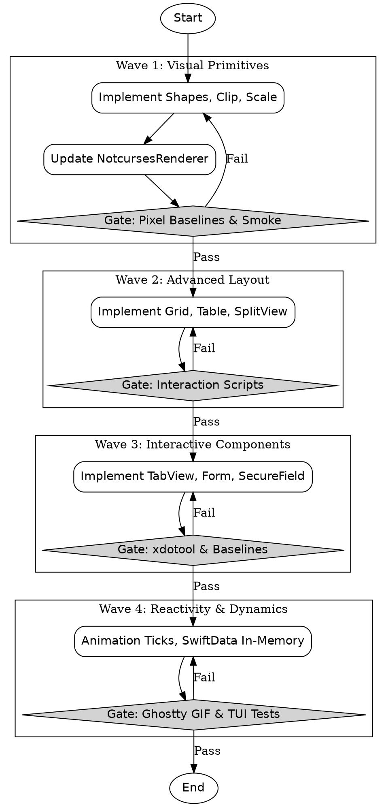

# SPRINT-009: KitchenSink Attractor Run — Making OmniUI TUI Features Real

## Overview
This sprint focuses on elevating OmniUI from a compiled 1:1 SwiftUI API surface to a fully functioning TUI environment. By systematically addressing the "partially working" and "not working" features identified in the KitchenSink demo, we will produce visually distinct and interactive terminal approximations for complex SwiftUI components. This will be executed as a structured Attractor run, grouping features into logical implementation waves with rigorous validation gates designed around human review and automated testing.

## Use Cases
- **Shapes and Visuals:** Developers can use `Rectangle`, `Circle`, `.clipShape`, and `Label` with system images and expect meaningful cell-based terminal output (e.g., braille/block fills) rather than empty space or crude fallbacks.
- **Advanced Layouts:** Grids (`LazyVGrid`, `Grid`), `Table`, and `NavigationSplitView` behave predictably, allowing for complex, data-dense terminal layouts.
- **Interactive Forms and Data:** Forms are correctly inset, `SecureField` components mask user input natively, and `List` trees expand/collapse gracefully.
- **Reactivity and Motion:** `ProgressView` elements tick, simple animations update across frames, and `@Observable` models trigger UI re-renders correctly.

## Architecture
- **Rendering Enhancements:** The `NotcursesRenderer` will be extended to handle custom sprixel-based shapes and masking via cell fills or Kitty graphics protocol when available.
- **State and Reactivity:** The core OmniUI runtime loop will incorporate animation ticking and integrate `@Observable` and `SwiftData` in-memory shims to trigger `needsRender`.
- **Attractor Workflow:** The run will use the `AttractorTaskExecutor` pattern. Each wave will perform code generation, followed by a human validation gate involving Ghostty-lab visual proofs, Kitty pixel-baseline odiff comparisons, and `tui-test.sh` smoke runs.

## Implementation (Phased Waves)

### Wave 1: Visual Primitives & Shapes
- **Features:** Shapes (cell-based fill for Circle, Rectangle, etc.), `.clipShape` (terminal bounds clipping), `.scaleEffect` (map to bold/spacing), `Label` system images (SF Symbol fallback mapping), and `AsyncImage` (placeholder text).
- **Tasks:** Update `Primitives.swift` for shape properties and `Modifiers.swift` for `.clipShape`. Enhance `NotcursesRenderer.swift` to handle basic clipping boundaries.
- **Validation Gate:** Capture `Tests/tui/baselines/shapes_baseline.png`. Pass smoke tests.

### Wave 2: Advanced Layout & Structure
- **Features:** `LazyVGrid`, `LazyHGrid`, `Grid`, `GridRow`, `Table` (multi-column), and `NavigationSplitView` (proper column width calculations).
- **Tasks:** Implement layout algorithms in `Primitives.swift` for grid and table structures. Ensure split views utilize exact cell widths.
- **Validation Gate:** Capture `Tests/tui/baselines/layout_baseline.png`. Add interaction scripts for `Table` scrolling.

### Wave 3: Interactive Components
- **Features:** `TabView` (border/content area visual separation), `List(children:)` (tree expand/collapse), `EditButton` / `.onDelete`, `Form(.grouped)` (inset styling), `SecureField` (input masking).
- **Tasks:** Modify `Modifiers.swift` and `Primitives.swift` for stateful tree and tab behaviors. Ensure `ncreader` masks input for `SecureField`.
- **Validation Gate:** Capture `Tests/tui/baselines/interactive_baseline.png`. Run new `xdotool` scripts for tab switching and tree navigation.

### Wave 4: Reactivity & Dynamics
- **Features:** `Animation`/`withAnimation` (tick-driven re-render loops), `Transitions`, `ProgressView` (spinner cycling), `@Observable` / `@Model` (trigger renders), `SwiftData` (in-memory `.modelContainer` and `@Query`), `Gesture` (map terminal mouse events).
- **Tasks:** Hook into `NotcursesRenderer.swift` tick loop. Connect `@Observable` invalidations to the runtime's render cycle.
- **Validation Gate:** Generate Ghostty-lab `.gif` captures showing spinners and tick updates. Pass all parity source gates.

### Attractor DOT Workflow

## Files Summary
- `Sources/OmniUICore/Primitives.swift`: Implement layout logic (Grid, Table) and expand stateful views (TabView, List).
- `Sources/OmniUICore/Modifiers.swift`: Update `.clipShape`, `.scaleEffect`, and grouped Form styles.
- `Sources/OmniUINotcursesRenderer/NotcursesRenderer.swift`: Hook animation ticks, sprixel cell approximations, and masking for `SecureField`.
- `Tests/tui/baselines/*`: New pixel baselines for each wave validation.
- `Tests/tui/interactions/*`: New `xdotool` interaction scripts to test stateful changes.

## Definition of Done
1. Every KitchenSink section renders visibly without blank spaces in the notcurses renderer.
2. All 21 identified partial/broken features yield distinct terminal output.
3. Animation tick loop successfully drives visual changes (e.g., `ProgressView` spinners).
4. New pixel baselines (`TUI_TEST_MODE=kitty scripts/tui-test.sh`) are captured and pass `odiff` checks.
5. Attractor framework successfully collects artifacts (screenshots, stderr, diffs) across all validation gates.

## Risks
- **Terminal Capabilities:** Not all terminals support the Kitty graphics protocol; cell-block fallbacks for shapes might be visually jarring or lower fidelity.
- **Reactivity Overhead:** Linking `@Observable` and `SwiftData` directly to the `needsRender` tick could cause performance bottlenecks in a terminal environment.

## Security
- `SecureField` implementation must correctly interface with `ncreader` to guarantee masked inputs are not leaked to stderr or debug logs.
- No third-party network requests are introduced (`AsyncImage` will use placeholder text or local sprixel rendering).

## Dependencies
- Requires the existing `NotcursesRenderer` and its linked `notcurses` C library.
- Relies on `Ghostty-lab` and `odiff` for the visual verification gates.

## Open Questions
1. **SwiftData Scope:** We are committing to in-memory query support for `@Query` and `modelContainer` to unblock basic logic, avoiding persistent SQLite overhead for now.
2. **Gestures:** Terminal mouse events (click, drag, scroll) will be mapped to tap and drag gestures.
3. **AsyncImage:** Will render as placeholder text initially, with potential follow-up for Kitty graphics protocol rendering if cell limits permit.
4. **.clipShape:** Will approximate via visual bounding boxes and strict color bounds within the cell matrix.
